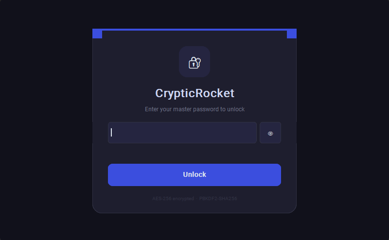
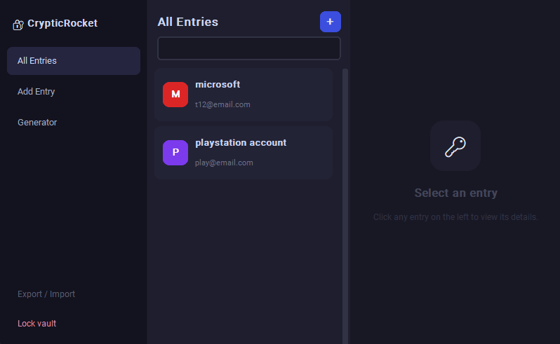
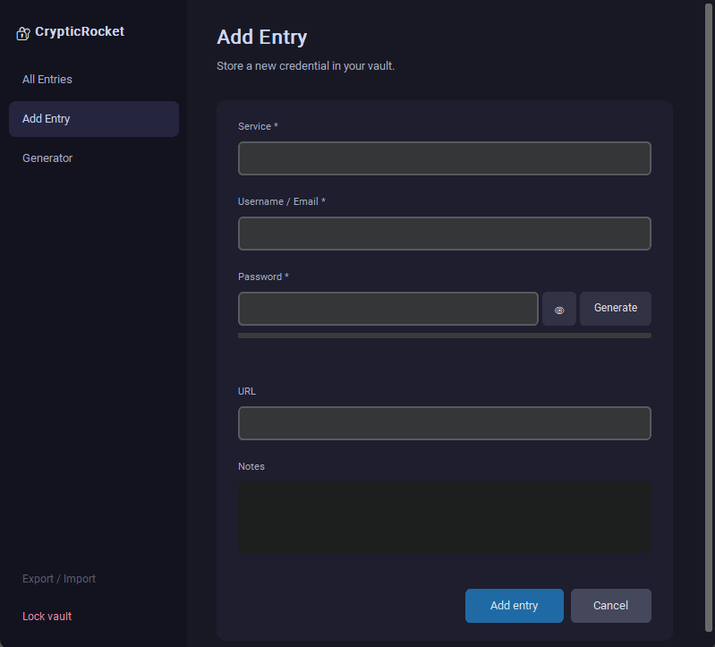
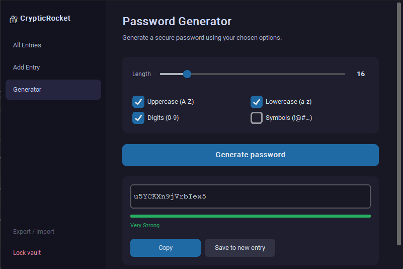

# CrypticRocket Password Manager

A secure, polished desktop password manager built with Python and CustomTkinter.
Your credentials live in a Fernet-encrypted vault that is **useless without your master password** — which is never stored anywhere.

---

## Security model

| Layer | Implementation |
|---|---|
| Key derivation | PBKDF2HMAC-SHA256, 480 000 iterations, 32-byte random salt (`salt.bin`) |
| Encryption | Fernet (AES-128-CBC + HMAC-SHA256) — authenticated; tampering is detectable |
| Master password | Never written to disk; wrong password → `InvalidToken` exception → access denied |
| Password generation | Python `secrets` module (CSPRNG); guaranteed ≥1 char from each selected class |
| Clipboard | Auto-cleared 15 seconds after copy |
| Inactivity lock | Vault auto-locks after 5 minutes of no keyboard/mouse activity |

---

## Requirements

- Python 3.11+
- Dependencies in `requirements.txt`:
  - `cryptography` — Fernet encryption + PBKDF2HMAC KDF
  - `customtkinter` — modern dark-mode GUI
  - `pyperclip` — cross-platform clipboard access

---

## Install

```bash
# Clone the repo
git clone https://github.com/V0ID-8/password_manager.git
cd password_manager

# (Recommended) create a virtual environment
python -m venv .venv

# Activate it:
# Windows:
.venv\Scripts\activate
# macOS / Linux:
source .venv/bin/activate

# Install dependencies
pip install -r requirements.txt
```

---

## Run

```bash
python main.py
```

**First launch** — you will be asked to set a master password (minimum 8 characters). This creates two files in the project directory:

- `vault.enc` — your encrypted credentials
- `salt.bin` — the KDF salt (required to derive your key)

Both files are listed in `.gitignore` and will **never** be committed.

**Subsequent launches** — enter your master password to unlock.

---

## Features

| Feature | Details |
|---|---|
| Master password gate | First-run setup + unlock screen with show/hide toggle |
| Add entry | Service, username/email, password, URL, notes |
| Edit entry | Update any field inline; vault re-encrypted on save |
| Delete entry | Confirmation dialog prevents accidental deletion |
| Search | Partial, case-insensitive match on service name or username |
| Password reveal | Hidden by default; reveal on demand |
| Copy to clipboard | One click; auto-clears after 15 s |
| Password generator | Configurable length (8–64) and character classes; strength meter |
| Save generated password | Opens Add Entry dialog pre-filled with the generated password |
| Auto-lock | Locks after 5 minutes of inactivity |
| Export vault | Saves `vault.enc` + `salt.bin` as a `.zip` backup |
| Import vault | Restores from a `.zip` backup (triggers re-lock) |

---

## Project structure

```
password_manager/
├── main.py            # entry point
├── crypto.py          # KDF, encrypt, decrypt
├── vault.py           # Vault class: load/save/add/search/update/delete
├── generator.py       # secure password generation + strength scoring
├── ui/
│   ├── app.py         # root CTk window + MainFrame with sidebar
│   ├── unlock.py      # master-password gate
│   ├── entry_list.py  # scrollable list + detail panel
│   ├── add_dialog.py  # add / edit entry modal
│   ├── generator_view.py
│   ├── export_import.py
│   └── widgets.py     # StrengthMeter, Toast
├── requirements.txt
├── README.md
└── .gitignore
```

Runtime files (`vault.enc`, `salt.bin`) are created on first run and are excluded from version control.

---

## Screenshots









---

## License

MIT
